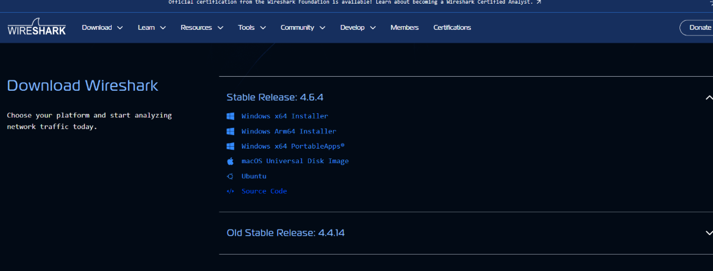
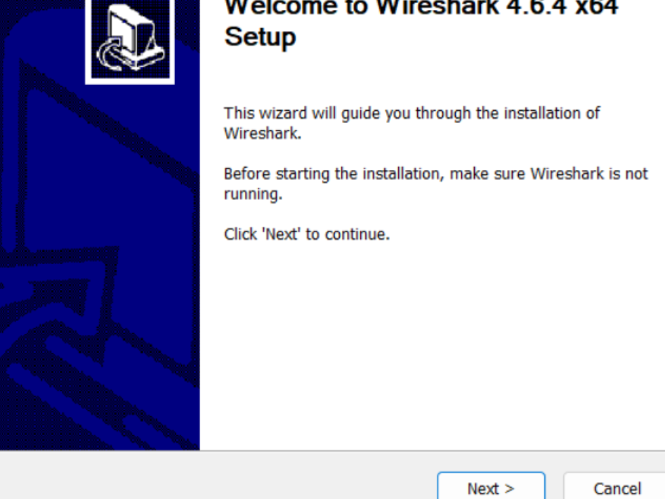
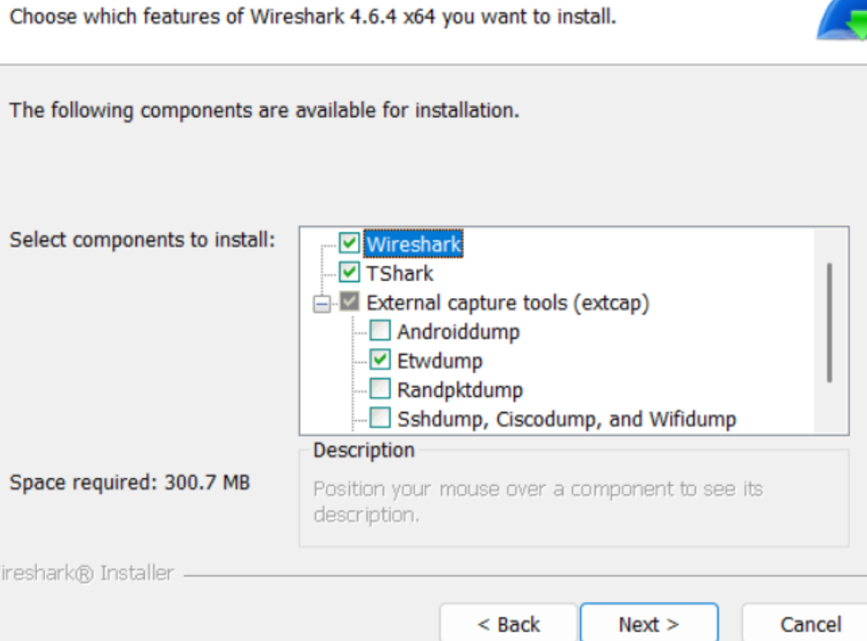
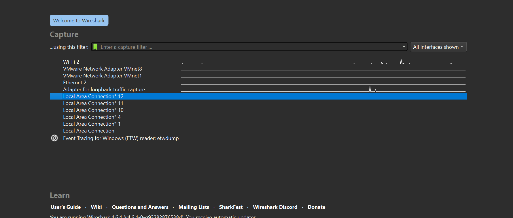

# Cara Instalasi Wireshark

Download wireshark melalui browser, pilih yang windows x64 installer

Setelah proses download selesai lanjut ke instalasi dengan doble klik pada wireshark yang telah didownload

Klik next-next sampai instalasi dilakukan lalu klik finish/selesai

Berikut tampilan setelah proses instalasi dilakukan dan masuk ke aplikasi wireshark
