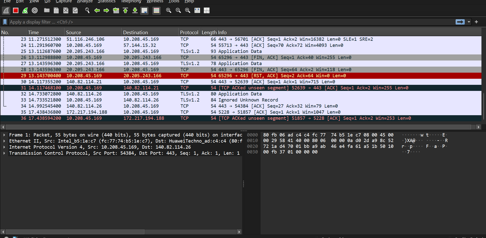
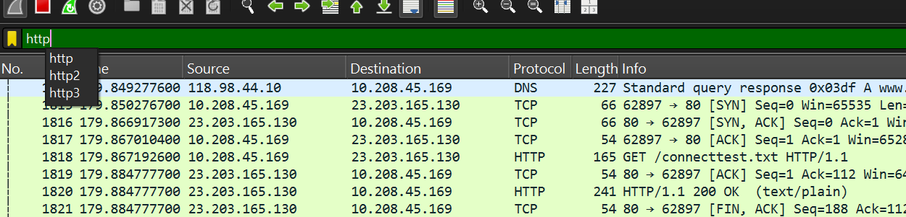
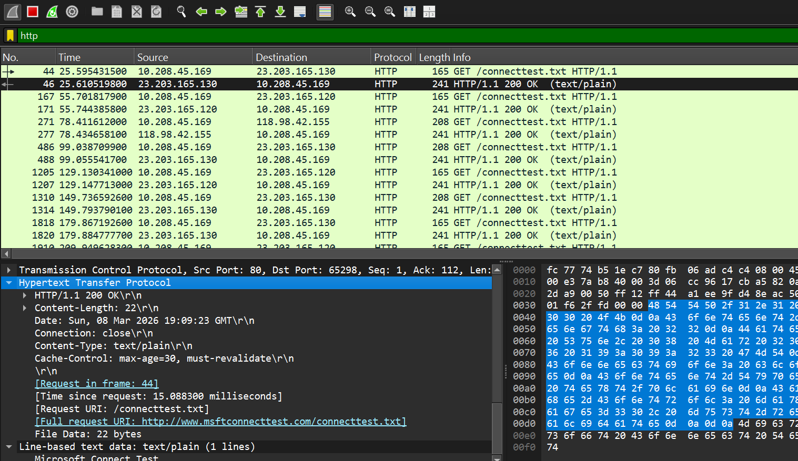

# Langkah-langkah Menggunakan aplikasi Wireshark (HTTP)

Pertama buka browser dan mengakses alamat web yang berbasis HTTP (Contoh : https://imada.sdu.dk/~jamik/dm557-19/wireshark/wireshark-http.html)

Setelah itu buka Wireshark, pada tampilan awal pilih wifi (jika menggunakan wifi namun jika menggunakan LAN bisa pilih ethernet)

 tampilan setelah memilih opsi wifi
 

 di bagian atas ada kolom yang bisa di gunakan untuk filter suatu protokol yang berguna untuk mempermudah mencari protokol yang ingin di cari, misal kita cari pada kolom tersebut "HTTP"
 

 Tampilan setelah mencari protokol "HTTP"
 